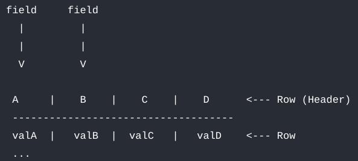
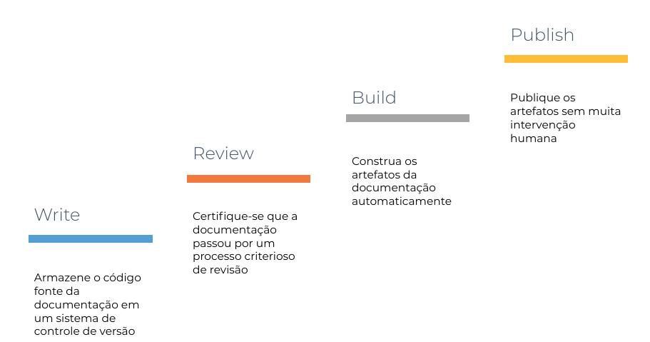
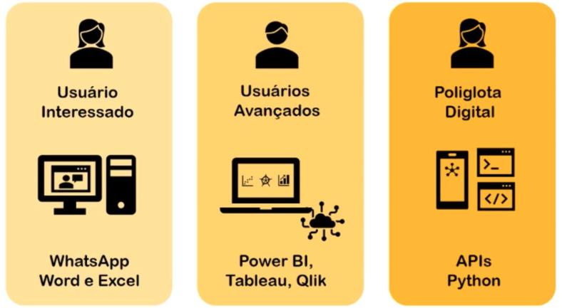

## Datapackage Manager for CKAN - DPCKAN

Como Gerenciar Dados Abertos com o [DPCKAN](https://pypi.org/project/dpckan/).

Note:
Agradecer a oportunidade e o convite.

Falar que fizemos os dois cursos a importância em nosso trabalho.

## Agenda

- Quem Somos
- Princípios e diretrizes
- Mão na massa
- Perguntas e respostas

Note:
Tempo Estimado de 1:15 de apresentação com 15 minutos para perguntas e respostas

## Quem Somos

- Administradores Públicos de formação.
- Servidores da Controladoria-Geral do Estado de Minas Gerais - [CGE-MG](https://cge.mg.gov.br/). 
- Lotados na Diretoria Central de Transparência Ativa:
	- [Portal da Transparência MG](https://www.transparencia.mg.gov.br/)
	- [Portal de Dados Abertos MG](https://dados.mg.gov.br/)

## Princípios e diretrizes

- Dados públicos, referenciados na internet.
- Disponibilizados sob licença aberta.
- Estruturado em formato aberto.
- Processáveis por máquina.

Note:
Licença Aberta: Permitir sua reutilização

Estruturado em formato aberto: Sistemas não proprietários como arquivos csv.

Formato aberto: Dados normalizados

## Mão na massa
 

Note: 
Vamos publicar nosso primeiro conjunto de dados no utilizando a interface gráfica do [CKAN](http://treinamento.cge.mg.gov.br/).

Utilizaremos como exemplo a base de [Crimes Violentos](https://dados.mg.gov.br/dataset/crimes-violentos).

## Mão na massa - Experimento mental

[Se uma informação só existe com a pessoa que a gerou, e essa pessoa não está disponível, essa informação realmente existe?](https://www.youtube.com/watch?v=JUW60w1jDdM&t=1346s) 

Parafraseando [@mtholder](https://twitter.com/kcranstn/status/370914072511791104?s=20), você, de 6 meses atrás, não está mais disponível.

## Mão na massa - Fontes de Fricção

- Nomes de variáveis
- Encoding
- Delimitadores
- Os dados estão corretos? [Frictionless Data Specifications](https://specs.frictionlessdata.io/#overview)

Note:
Falar sobre a importância do encoding e delimitadores e da diferença para o padrão internacional.

Separador de milhar, separador de decimal.

Padrão csv brasileiro utiliza o ';' no lugar da ','. Problemas para existência de valores com vírgula (decimal) no arquivo. 

## Mão na massa - Docs Like Code

[Anne Gentle](https://www.docslikecode.com/)

Note:
Caso haja alguma pergunta exemplificar com as [sugestões de melhoria](https://dados.mg.gov.br/dataset/crimes-violentos#:~:text=tamb%C3%A9m%20ser%C3%A3o%20inclu%C3%ADdos.-,Como%20participar,-Saiba%20como%20contribuir).

Exemplo COD_MUNICIPIO que pode ser melhor explicado.

## Mão na massa - dpckan

[CKAN](https://ckan.org/) + [Frictionless](https://frictionlessdata.io/) = [dpckan](https://github.com/transparencia-mg/dpckan)

CLI Python disponível no [Pypi](https://pypi.org/project/dpckan/)

	# Utilização Linux
	python3 -m venv venv
	source venv/bin/activate
	pip install dpckan
	pip list

	# Utilização Windows
	python -m venv venv
	source venv/Scripts/activate
	pip install dpckan
	pip list

Note:
Ambiente virtual como boa prática.

CKAN garante a disponibilização na Web.

Frictionless garante padrão de qualidade via dados legíveis por máquina.

dpckan garante a publicação em escala de vários recursos para um único conjunto.

## Mão na massa - dpckan
	
	# Inferência de metadados - datapackage.json
	frictionless describe crimes_violentos.csv --type package --json > datapackage.json

	# Validando meus dados
	frictionless validate datapackage.json

	# Publicação de um conjunto de dados
	# Leitura das mensagens de erro
	dpckan --ckan-host https://treinamento.cge.mg.gov.br --ckan-key <ckan-key> dataset create
	dpckan dataset update
	dpckan resource create
	dpckan resource update

Note:
O que está sendo feito e porque?

Qual alternativa: [datapackage creator](https://create.frictionlessdata.io/).

Prós e contras.

## Problemas do modelo

Note:
E difícil contar com a disposição das pessoas em operar a linha de comando, pois são poucos os poliglotas.

Nós, administradores do sistema ilhados neste contexto.

Baixa adesão ao modelo proposto.

Utilização da GitBash para Windows

## Problemas do modelo - Solução

[CKANEXT DATAPACKAGE CREATOR](https://pypi.org/project/ckanext-datapackage-creator/)

[Demonstração](http://treinamento.cge.mg.gov.br/)

Notes:
Futura GUI a ser instalado em nossa instância do CKAN.

Para personas non poliglotas em dados.

Melhora interação com Frictionless e possibilidade de publicar e baixar dados em massa, com metadados padronizados e especificados legivelmente por máquina, tanto as estruturas físicas e lógicas - o próprio dicionário de dados é estruturado)

constantes atualizações nas dependências do CKAN (bootstrap, etc); atrasos nas estimativas de versões; ; ; preferência pelo apelo visual (dashboards, gráficos, resumos 'at a glance') em detrimento da granularidade e completude das bases acessíveis por código aberto

# Próximos passos - Desafios

Treinamento:
	- Ecossistema de demanda e oferta de dados incipiente em MG.
	- Gap de conhecimento tanto de publicadores quanto de usuários - Data Literacy.
	- Conhecimentos específicos até para o pessoas que trabalham na área.

Gestão da Política:
	- Gestão do contrato com a fornecedora que nos auxiliou na construção da extensão complexa.
	- Tamanho do banco necessário para comportar bases complexas (dados geospaciais).

Notes:

## Perguntas e respostas

## Contatos

gabriel.dornas@cge.mg.gov.br
andre.amorim@cge.mg.gov.br
flavia.vilela@cge.mg.gov.br

https://github.com/transparencia-mg/

## Muito Obrigado