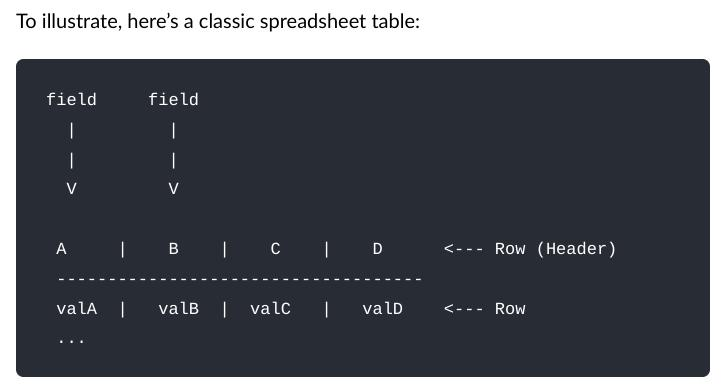

## Datapackage ManagerS - Ferramentas de gerenciamento de dados no CKAN

Como Gerenciar Dados Abertos com o [DPCKAN](https://pypi.org/project/dpckan/).

Note:
- Agradecer a oportunidade e o convite.
- Falar que fizemos os dois cursos a importância em nosso trabalho (contexto de reformulação do portal como portal de fato, definições de qualidade e expansão).
- Convidar para visitar os links que serão mostrados, navegar pelo Portal e testar o dpckan (importância do fomento ao ecossitema).
- Perguntas no chat e respostas ao final da apresentação;
- Tempo Estimado de 1:15 de apresentação com 15 minutos para perguntas e respostas. Momentos final para responder perguntas e conversar.

## Agenda

- Quem somos
- Princípios e diretrizes
- Mão na massa
- Aprendizados
- Novas soluções
- Próximos desafios
- Perguntas e respostas

## Quem somos

- Servidores Públicos na Controladoria-Geral do Estado de Minas Gerais - [CGE-MG](https://cge.mg.gov.br/). 
- Lotados na Diretoria Central de Transparência Ativa:
	- [Portal da Transparência MG](https://www.transparencia.mg.gov.br/)
	- [Portal de Dados Abertos MG](https://dados.mg.gov.br/)

Note:
- Competências da DCTA relacionadas ao mão na massa: Gerenciar e propor a evolução das consultas e demais funcionalidades do Portal da Transparência e do Portal de Dados Abertos do Poder Executivo, com o objetivo de aprimorar a divulgação das informações junto à sociedade; fomentar a disponibilização de informações públicas em formato aberto no Portal da Transparência e nos sítios eletrônicos dos órgãos e entidades do Poder Executivo; planejar e coordenar o desenvolvimento das regras de negócio para as ferramentas e sistemas visando a promoção da transparência ativa no âmbito do Poder Executivo;

## Princípios e diretrizes

- Dados públicos, referenciados na internet.
- Disponibilizados sob licença aberta.
- Estruturado em formato aberto.
- Processáveis por máquina.

Note:
- LAI já tinha estabelecido todas essas premissas em 2011, e houve uma replicação delas com a Lei do Governo Digital, em âmbito federal. Decretos estaduais em MG.
- Licença Aberta: Reutilização em apps e visualizações atribuindo a mesma licença.
- Formato aberto: Não proprietários, como arquivos csv para dados tabulares.
- Definição da [Lei de Governo Digital](https://www.planalto.gov.br/ccivil_03/_ato2019-2022/2021/lei/l14129.htm) - formato aberto: formato de arquivo não proprietário, cuja especificação esteja documentada publicamente e seja de livre conhecimento e implementação, livre de patentes ou de qualquer outra restrição legal quanto à sua utilização;
- Legível por máquina: Dados normalizados (arquivos json para metadados). Leitura por máquina tanto dos dados quanto dos metadados
- Definição de especificação de metadados na [LAI](https://www.planalto.gov.br/ccivil_03/_Ato2011-2014/2011/Lei/L12527.htm#art8): IV - divulgar em detalhes os formatos utilizados para estruturação da informação;

## Princípios e diretrizes - escala de maturidade de dados

Note:
- Leis dos dados abertos (David Eaves): Se o dado não pode ser encontrado e indexado na web, ele não existe. Se não estiver aberto e disponível em formato compreensível por máquina, ele não pode ser reaproveitado. Se algum dispositivo legal não permitir sua reaplicação, ele não é útil. (correspondência com 3 primeiros patamares)
- CKAN garante o acesso, mas não a licença, o formato estruturado e aberto;
- Protagonismo do publicador, CGE órgão central como indutor;
- Processo de qualidade = edição e verificação de metadados legíveis por máquina (incorporação de 'validação' da Frictionless; termo usado para comparar se a descrição da estrutura lógica dos dados/metadados está de acordo com os próprios dados - não serve para verifiar a semântica dos dados no mundo real, que é o papel do órgão responsável pela publicação)
- Incorporação desse processo de verificação de qualidade como incentivo à adesão de mais órgãos publicadores, pois pode ser incorporado como bônus para outras rotinas

## Mão na massa
 

Note: 
- Vamos publicar nosso primeiro conjunto de dados no utilizando a interface gráfica do [CKAN](https://treinamento.dadosabertos.cge.mg.gov.br/).
- Utilizaremos como exemplo a base de [Crimes Violentos](https://dados.mg.gov.br/dataset/crimes-violentos), publicada seguindo os princípios e diretrizes mencionados.

## Mão na massa - Experimento mental

- [Se uma informação só existe com a pessoa que a gerou, e essa pessoa não está disponível, essa informação realmente existe?](https://www.youtube.com/watch?v=JUW60w1jDdM&t=1346s) 

- Parafraseando [@mtholder](https://twitter.com/kcranstn/status/370914072511791104?s=20), você, de 6 meses atrás, não está mais disponível.

Note:
- Experimento mental feito por Francisco CODA 2021.
- Mostrar ambiente de produção crimes violentos e convidar para visita do site.
- Primeira pausa para perguntas.

## Mão na massa - Fontes de Fricção

- Nomes de variáveis
- Encoding
- Delimitadores
- Os dados estão corretos? [Frictionless Data Specifications](https://specs.frictionlessdata.io/#overview)

Note:
- Metadados do conjunto utilizado estão na versão em produção.
- 
- Encoding e delimitadores no padrão internacional.
- Separador de milhar e decimal no padrão internacional.
- Padrão csv brasileiro com ';'.

## Mão na massa - Docs Like Code

[Anne Gentle](https://www.docslikecode.com/)

Note:
- [sugestões de melhoria crimes violentos](https://dados.mg.gov.br/dataset/crimes-violentos#:~:text=tamb%C3%A9m%20ser%C3%A3o%20inclu%C3%ADdos.-,Como%20participar,-Saiba%20como%20contribuir).
- SOMENTE SE QUESTIONADO: Exemplo COD_MUNICIPIO pouco documentado.

## Mão na massa - dpckan

[CKAN](https://ckan.org/) + [Frictionless](https://frictionlessdata.io/) = [dpckan](https://github.com/transparencia-mg/dpckan)

CLI Python disponível no [Pypi](https://pypi.org/project/dpckan/)

	# Utilização Linux
	python3 -m venv venv
	source venv/bin/activate
	pip install dpckan
	pip list

	# Utilização Windows
	python -m venv venv
	source venv/Scripts/activate
	pip install dpckan
	pip list

Note:
- Ganhador do hackaton frictionless em 2021
- Utilização da GitBash para Windows
- venv como boa prática.
- CKAN garante a disponibilização na Web.
- Frictionless garante leitura por máquina e qualidade.
- dpckan garante a publicação em escala de vários recursos para um único conjunto.

## Mão na massa - dpckan

[CKAN](https://ckan.org/) + [Frictionless](https://frictionlessdata.io/) = [dpckan](https://github.com/transparencia-mg/dpckan)
	
	# Inferência de metadados - datapackage.json
	frictionless describe crimes_violentos.csv --type package --json > datapackage.json

	# Validando meus dados
	frictionless validate datapackage.json

	# Publicação de um conjunto de dados
	# Leitura das mensagens de erro
	dpckan --ckan-host https://treinamento.dadosabertos.cge.mg.gov.br --ckan-key <ckan-key> dataset create
	dpckan dataset update
	dpckan resource create
	dpckan resource update

Note:
- [Datapackage creator](https://create.frictionlessdata.io/).
- Prós e contras de cada alternativa.

## Aprendizados

Note:
- E difícil contar com a disposição das pessoas em operar a linha de comando, pois são poucos os poliglotas.
- Baixa adesão ao modelo proposto.
- Ficamos ilhados neste contexto.

## Novas soluções

- [CKANEXT DATAPACKAGE CREATOR](https://pypi.org/project/ckanext-datapackage-creator/) = dpckan na interface gráfica do CKAN!

[Demonstração](http://projetockan.cge.mg.gov.br/)

Note:
- Futura GUI a ser instalado em nossa instância do CKAN.
- Para personas não poliglotas em dados.
- Melhora interação com processo de documentação.
- dpckan não continuará em utilização.
- Segunda pausa para perguntas.

## Próximos desafios

- Ecossistema de demanda e oferta de dados incipiente em MG.
- Gap de conhecimento tanto de publicadores quanto de usuários - Data Literacy.
- Conhecimentos específicos até para as pessoas que trabalham na área.
- Tamanho do banco necessário para comportar bases complexas (dados geospaciais).

## Mais perguntas do que respostas

[Perguntas recebidas no chat](https://transparencia-mg.github.io/handbook/0.1/posts/20230328_apresentacao_dpckan_curso_ckan/#perguntas-e-respostas)

## Contatos

andre.amorim@cge.mg.gov.br
flavia.vilela@cge.mg.gov.br
gabriel.dornas@cge.mg.gov.br

https://github.com/transparencia-mg/

## Muito Obrigado
