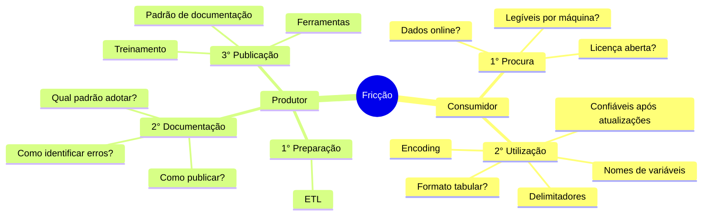

# Minas de Dados
Ferramentas e estratégias para incentivar a cultura de criação e utilização de dados no Estado de Minas Gerais

Note:
- Agradecer a oportunidade e o convite.
- Crédito à apresentação feita por Francisco no evento CodaBr2021.
- Convidar para visitar os links que serão mostrados ao longo da apresentação.
- Perguntas ao longo da apresentação.
- Tempo Estimado de uma hora.

## Agenda

## Vamos fazer um experimento mental...

Se uma informação só existe com a pessoa que a gerou, e essa pessoa não está disponível, essa informação realmente existe?

Note:
- Documentar é um ato de auxílio a si próprio, pois você de meses atrás não responde e-mails, segundo este [twitter de Karen Cranston](https://twitter.com/kcranstn/status/370914072511791104?s=20), você, de 6 meses atrás, não está mais disponível).

## Contextualização

### Teste
-

-
-
-
- Os dados estão corretos após a última atualização?

[Frictionless Data Specifications](https://specs.frictionlessdata.io/#overview)
