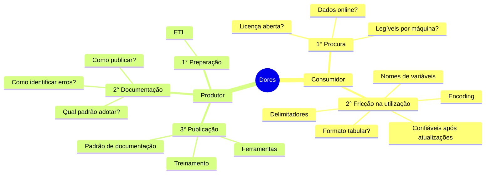
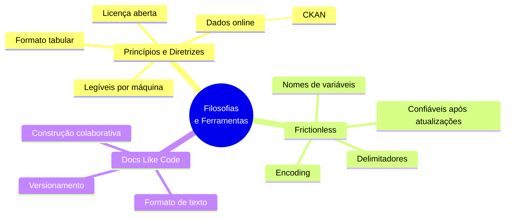
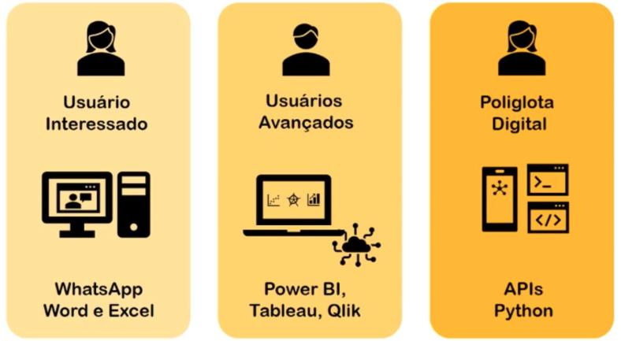

# Minas de Dados
Ferramentas e estratégias para incentivar a cultura de criação e utilização de dados no Estado de Minas Gerais

Note:
- Agradecer a oportunidade e o convite.
- Crédito à apresentação feita por Francisco no evento CodaBr2021.
- Convidar para visitar os links que serão mostrados ao longo da apresentação.
- Perguntas ao longo da apresentação.
- Tempo Estimado de uma hora.

## Agenda
- Contextualização
- Mão na massa

## Vamos fazer um experimento mental...

Se uma informação só existe com a pessoa que a gerou, e essa pessoa não está disponível, essa informação realmente existe?

Note:
- Documentar é um ato de auxílio a si próprio, pois você de meses atrás não responde e-mails, segundo este [twitter de Karen Cranston](https://twitter.com/kcranstn/status/370914072511791104?s=20), você, de 6 meses atrás, não está mais disponível).

## Contextualização

## Contextualização

Note:
- Escrita: Armazena o código fonte em sistema de controle de versão.
- Revisão: Processo criterioso de revisão.
- Construção: Feita de maneira automática.
- Publicação: Sem interferência humana.

## Mão na massa

## Mão na massa
Documentando um [dado](http://www.seguranca.mg.gov.br/2018-08-22-13-39-06/dados-abertos) que já está disponível online.

Note:
- Mostrar fricção como enconding e delimitador na prática.

## Mão na massa - Produtor

    # Iniciando trabalho com controle de versão
    mkdir demostracao-minas-de-dados
    cd demostracao-minas-de-dados
    mkdir data/ # Adicionando arquivos de dados (crimes_violentos)
    touch requirements.txt # incluindo ipdb e frictionless[pandas]==4.16.6
    touch .gitignore # incluindo pasta venv
    git init
    git branch -M main
    git add .
    git commit -m "Commit Inicial"

    # Ambiente virtual
    python3 -m venv venv
    source venv/bin/activate
    pip install -r requirements.txt

    # Documentação Inicial do conjunto
    frictionless describe data --type package --json > datapackage.json

## Mão na massa - Produtor

    # Novo arqquivo main.py
    from frictionless import Package

    package = Package('datapackage.json')
    recurso = package.get_resource('crimes_violentos')
    data_frame = recurso.to_pandas()

## Mão na massa - Consumidor

    import locale
    import calendar

    locale.setlocale(locale.LC_ALL, 'pt_BR.UTF-8')

    for ano in range(2018, 2024):
      for mes in range(1,13):
        numero_registros = data_frame.loc[(data_frame['Ano'] == ano) & (data_frame['Mês'] == mes )]
        numero_registros = numero_registros['Registros'].sum()
        numero_registros = format(numero_registros, "6,d").replace(",", ".")
        print(f'Foram registrados {numero_registros} crimes violentos em todo Estado de Minas (RISP) em {calendar.month_name[mes].capitalize()} de {ano}.')

## Mão na massa - Produtor

- Disponibilização via [GitHub](https://github.com/transparencia-mg/crimes-violentos) e [CKAN](https://dados.mg.gov.br/dataset/crimes-violentos) com auxílio da ferramenta [dpckan](https://github.com/transparencia-mg/dpckan).
- [Exemplo de documentação colaborativa](https://github.com/transparencia-mg/violencia-contra-mulher-old/pull/1/files) utilizando as ferramentas mostradas até aqui.

## Aprendizados

Documentação na [interface do CKAN](http://projetockan.cge.mg.gov.br/).

## Aonde queremos chegar

    import locale
    import calendar
    from requests import get

    locale.setlocale(locale.LC_ALL, 'pt_BR.UTF-8')

    ckan_datapackage = get('')
    package = Package(ckan_datapackage.json())
    resource = package.get_resource('crimes_violentos')
    data_frame = resource.to_pandas()

    for ano in range(2018, 2024):
      for mes in range(1,13):
        numero_registros = data_frame.loc[(data_frame['Ano'] == ano) & (data_frame['Mês'] == mes )]
        numero_registros = numero_registros['Registros'].sum()
        # import ipdb; ipdb.set_trace(context=10)
        numero_registros = format(numero_registros, "6,d").replace(",", ".")
        print(f'Foram registrados {numero_registros} crimes violentos em todo Estado de Minas (RISP) em {calendar.month_name[mes].capitalize()} de {ano}.')
